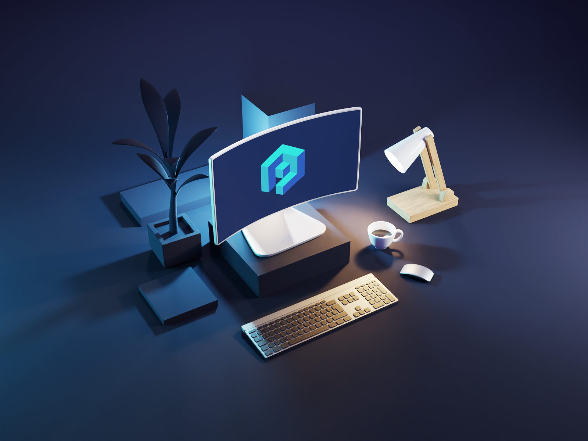
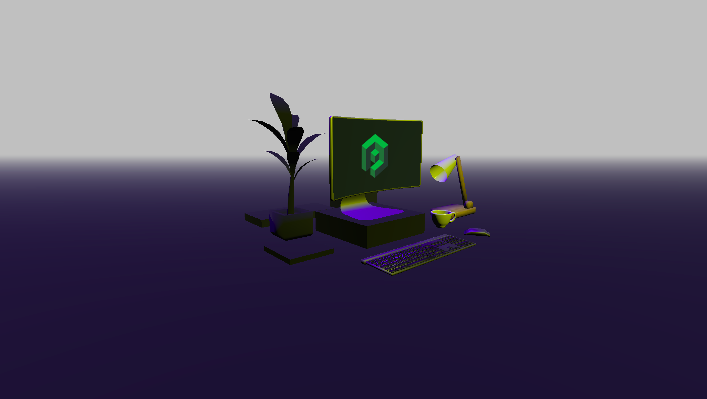
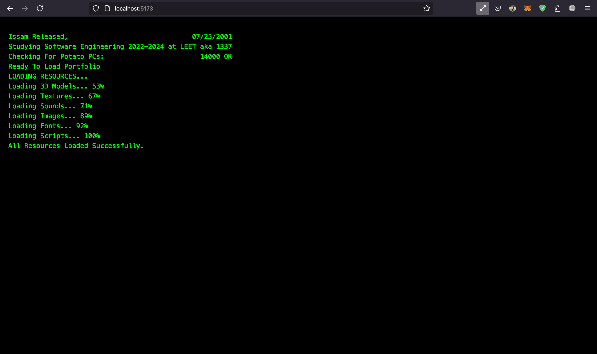

# Portfolio-beta
This will be my second attempt on creating a 3D computer graphics in a web browser using Three.Js library. It's still a beta version, there is a lot of things I'm excited to add.
## Features

- **3D Graphics**: Utilizing the Three.js library to render 3D graphics in the browser.
- **Interactive Elements**: Users can interact with the 3D models.
- **Responsive Design**: Works on both desktop and mobile devices.

## Installation

1. Clone the repository:
	```sh
	git clone https://github.com/ChaoticIssam/portfolio-beta.git
	```
2. Navigate to the project directory:
	```sh
	cd portfolio-beta
	```
3. Install dependencies:
	```sh
	npm install
	```
4. Start the development server:
	```sh
	npm start
	```

## Screenshots
Design I worked on since I'm a beginner in Blender, all I have done is made minor changes on the design.



Here is a preview on how the project looked like during time I spent on it.



The loading page that I tried to use the "BIOS" them on it.


## Inspiration

The inspiration for this project came from my fascination with 3D graphics and web development. I was particularly inspired by a specific open-source project that showcased the capabilities of Three.js and Blender.

Here is some previews on that project and the developer's GitHub account that inspired me:


**GitHub**: [Henryjeff](https://github.com/henryjeff)


## Contributing

Feel free to submit issues or pull requests. For major changes, please open an issue first to discuss what you would like to change.

**Note**: The project is still under development, and new features and improvements are being added regularly. Stay tuned for updates! 
