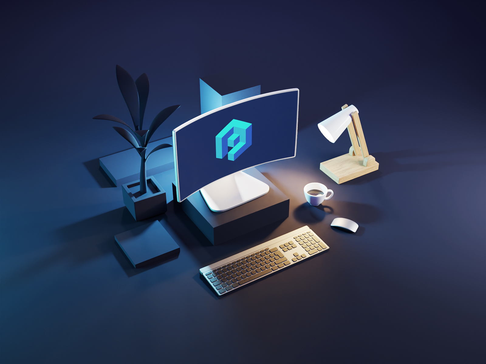
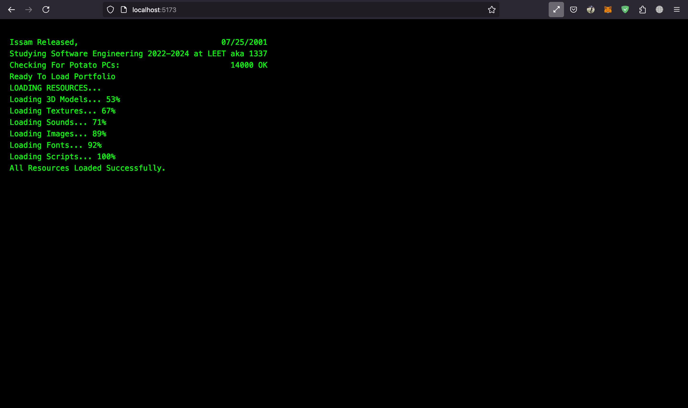
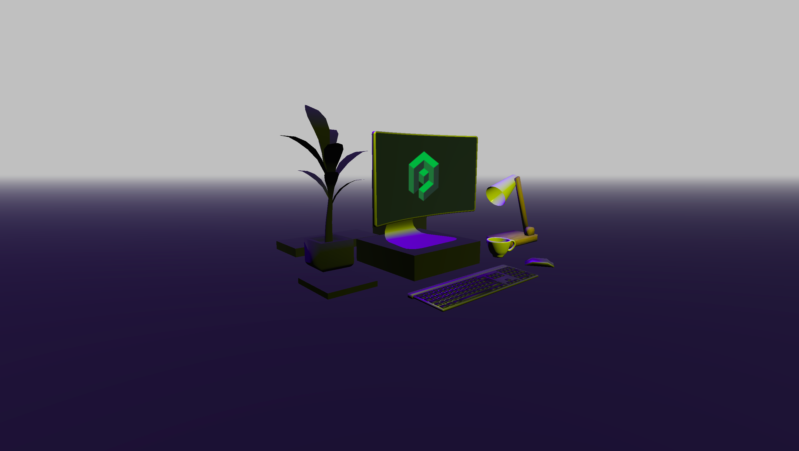

# 3D WebGL Interactive Portfolio

<div align="center">


An immersive, interactive **3D Developer Portfolio** built with **Three.js**, **React 19**, and **Tailwind CSS**. Features a retro-futuristic 3D workspace with a dynamic CRT monitor displaying a live, interactive UI via canvas texture projection and 3D raycast event dispatching.

[Explore Live Demo](#getting-started) · [Report Bug](https://github.com/ChaoticIssam/portfolio-beta/issues) · [Request Feature](https://github.com/ChaoticIssam/portfolio-beta/issues)

</div>

---

## 🌟 Key Features

- 🖥️ **Interactive 3D CRT Display**: Projects a live React component onto a curved 3D mesh texture in real-time using `html2canvas` and Three.js canvas texturing.
- 🎯 **3D Raycasting Event Proxy**: Interactive buttons, navigation links, and clipboard actions rendered directly on the 3D monitor mesh using raycasted mouse coordinates.
- 💾 **Retro BIOS Boot Sequence**: Nostalgic terminal boot experience with animated system checks, memory tests, and audio cues before entering the workspace.
- 🎨 **Minimalist Box-Free Design**: Clean, typography-first interface optimized for curved CRT readability with zero box artifacts or clutter.
- ⚡ **Smooth Camera Transitions**: Tween.js camera choreography that zooms in and focuses dynamically between the desk overview and CRT display.
- 🐳 **Docker & Nginx Deployment**: Multi-stage production container with custom Nginx GLB/GLTF MIME type support and aggressive caching control.

---

## 🛠️ Tech Stack

### Core Technologies
- **3D & Graphics**: [Three.js](https://threejs.org/) (r171), WebGL, Blender (GLTF/GLB models)
- **Frontend Framework**: [React 19](https://react.dev/), [Vite 6](https://vitejs.dev/)
- **Styling**: [Tailwind CSS v4](https://tailwindcss.com/), PostCSS
- **Animations**: [@tweenjs/tween.js](https://github.com/tweenjs/tween.js), Canvas 2D
- **Texture Rasterizer**: [html2canvas](https://html2canvas.hertzen.com/)
- **Infrastructure**: Docker (Multi-stage Node 20 / Nginx Alpine), Docker Compose, Make

---

## 📂 Project Structure

```text
portfolio-beta/
├── public/
│   ├── models/                # 3D Blender GLB/GLTF models
│   ├── sounds/                # Retro BIOS and UI sound effects
│   └── styles/                # Background textures and visual assets
├── srcs/
│   ├── comps/
│   │   ├── display.jsx        # Interactive screen sections (Home, About, Projects, Contact)
│   │   └── sectionNav.jsx     # Monospace section navigation bar
│   ├── images/                # Progress screenshots & Blender renders
│   ├── portfolio.js           # Three.js scene, raycasting, camera tweens, and canvas engine
│   └── loading.js             # Retro BIOS boot terminal sequence
├── portfolio.css              # Typography & custom WebGL CRT screen styling
├── Dockerfile                 # Multi-stage production container build
├── docker-compose.yml         # Container orchestration configuration
├── nginx.conf                 # Nginx server config with GLB/WASM mime types
├── Makefile                   # Automated build, dev, and Docker management targets
└── package.json               # Dependencies and build scripts
```

---

## 🚀 Getting Started

### Prerequisites
- [Node.js](https://nodejs.org/) (v18 or higher)
- [Docker & Docker Compose](https://www.docker.com/) (optional, for containerized run)

### Local Development

1. **Clone the repository**:
   ```bash
   git clone https://github.com/ChaoticIssam/portfolio-beta.git
   cd portfolio-beta
   ```

2. **Install dependencies**:
   ```bash
   npm install
   ```

3. **Start the Vite development server**:
   ```bash
   make dev
   # or
   npm run dev
   ```
   Open [http://localhost:5173](http://localhost:5173) in your browser.

---

## 🐳 Docker Deployment

The project includes automated Docker orchestration served through an optimized Nginx Alpine container:

```bash
# Build and start container in the background (runs on http://localhost:8090)
make docker-up

# Stop container
make docker-down

# Clean dangling image layers and builder cache
make docker-clean

# Full prune (removes dangling images, cache, and unused anonymous volumes)
make docker-prune

# Rebuild and restart container from scratch
make docker-re
```

---

## 📋 Available Makefile Commands

| Command | Description |
|---|---|
| `make dev` | Starts local Vite development server with Hot Module Replacement (HMR). |
| `make build` | Compiles the production bundle into `/dist`. |
| `make preview` | Locally previews the compiled production build. |
| `make clean` | Removes `/dist` and `.vite` cache directories. |
| `make docker-up` | Builds and launches the Docker container at `http://localhost:8090`. |
| `make docker-down` | Stops and removes the Docker container. |
| `make docker-clean` | Prunes dangling `<none>` images and builder cache. |
| `make docker-prune` | Deep prunes dangling images, build cache, and unused anonymous volumes. |
| `make docker-fclean` | Deep clean for all containers, images, volumes, and local artifacts. |
| `make docker-re` | Restarts and rebuilds the container from scratch. |

---

## 📸 Screenshots & Development Journey

### 3D Workspace Design & Blender Modeling
| Workspace Progress | Blender Wireframe View |
|:---:|:---:|
|  |  |

### Retro BIOS Boot Terminal & Lighting Engine
| BIOS Loading Terminal | Scene Lighting & Ambience |
|:---:|:---:|
|  |  |

---

## 👤 Author

**Issam Zitouni**
- **Role**: Full Stack Developer (React · TypeScript · FastAPI · Django · Three.js)
- **Education**: 1337 Coding School (42 Network) – Benguerir, Morocco
- **GitHub**: [@ChaoticIssam](https://github.com/ChaoticIssam)
- **LinkedIn**: [issam-zitouni](https://linkedin.com/in/issam-zitouni/)
- **Email**: [issamzitouni257@gmail.com](mailto:issamzitouni257@gmail.com)

---

## 🙏 Inspiration & Acknowledgments

- Inspired by the creative 3D web experiments by [Henryjeff](https://github.com/henryjeff).
- Built with the support and community at **1337 (42 Network)**.

---

## 📄 License

This project is licensed under the MIT License - see the [LICENSE](LICENSE) file for details.
